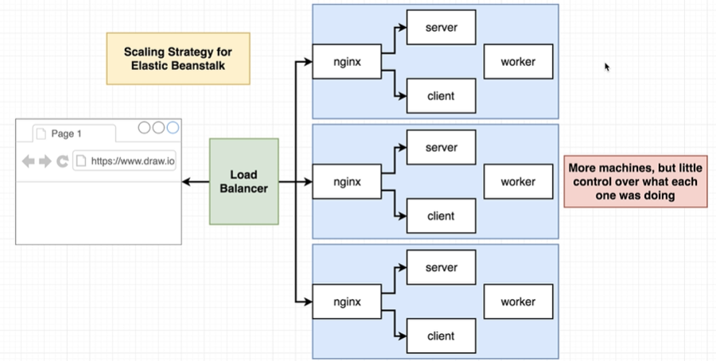
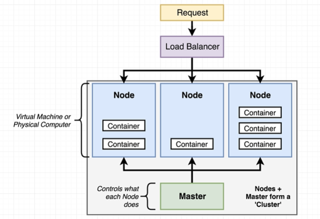
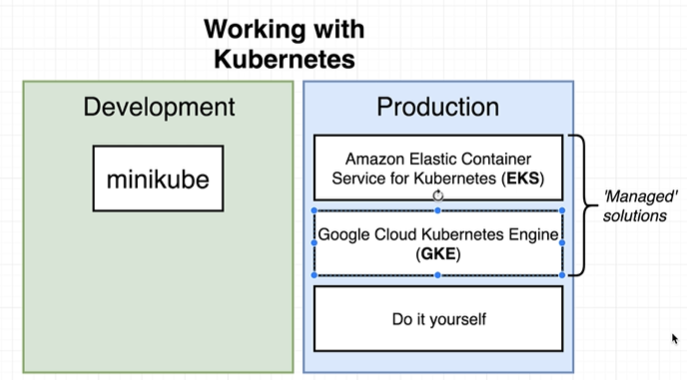
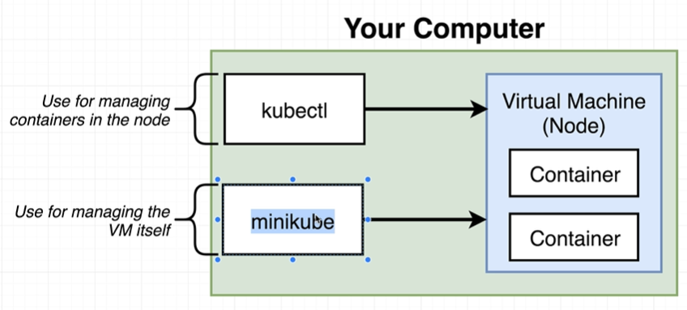
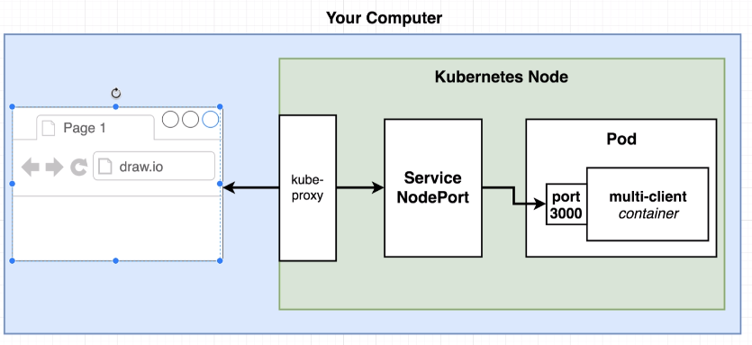
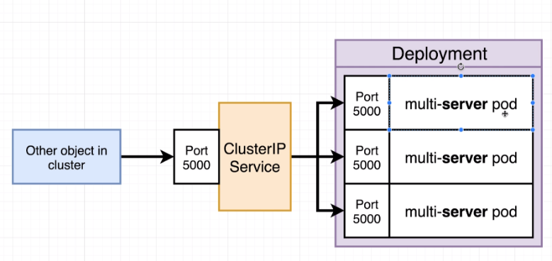
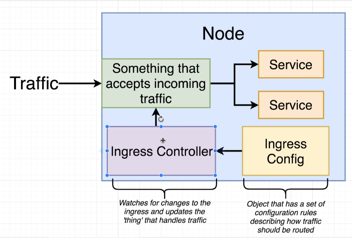
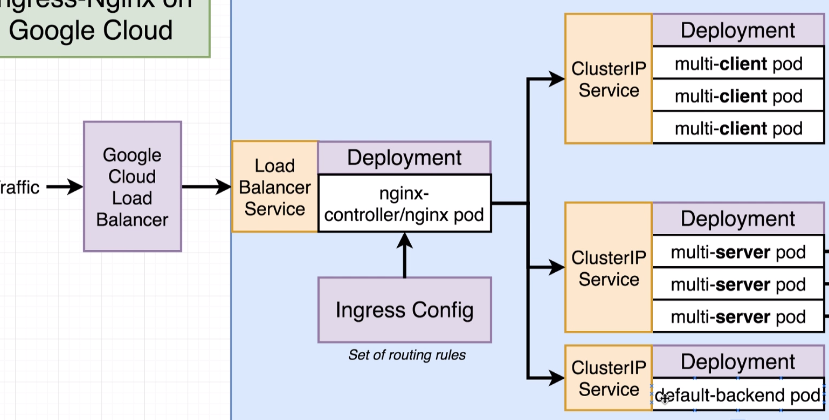
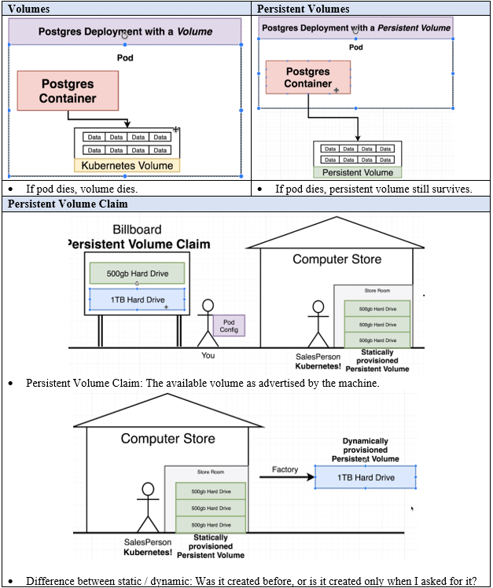
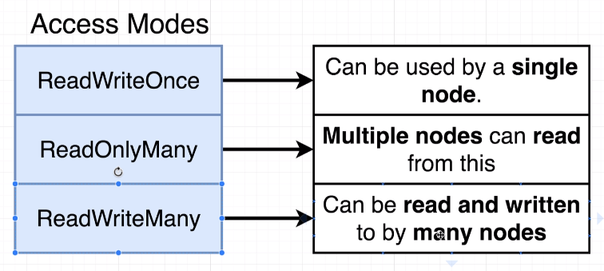

# Kubernetes

## Scaling traditionally vs Kubernetes

---

## Kubernetes ecosystem

The preferred way of deploying Kubernetes applications is declaratively, not imperatively!

---

---
## Kubernetes objects 

Configuration fields used this week:
- apiVersion: Used to identify different sets of ‘objects’ we can use.
- Labels/Selector key value pairs: Used to identify pods.

### Services
Abstract way to expose an app running on a set of Pods as a network service.

Four types:
- ClusterIP: Exposes a set of pods to other objects in the cluster.
- NodePort: Exposes a container to outside world.
- LoadBalancer: Legacy way of getting network traffic into a cluster.
- Ingress: Exposes a set of services to the outside world.

#### NodePort

#### ClusterIP

#### LoadBalancer
Limited as it can only be attached to one single set of pods.

#### Ingress
Like deployments, the ingress object is a controller.

There are typically two types of load balancers in production. The cloud provider load balancer, which balances requests across nodes, and the node load balancer, which balances requests across pods within a node.

Nginx ingress controller: Allows load balancing to specific pods, rather than letting the cluster ip service handle it.

### Volumes

### Secrets

---

## Commands
- Apply a config: `kubectl apply -f <config-filename>`
- Get an object: `kubectl get <object> <object-name>`
- Delete objects created from a config: `kubectl delete -f <config-filename>`
- Update object using new image: `kubectl rollout restart <object-type>/<object-name>`
- Create a secret: `kubectl create secret generic <secret-name> --from-literal key=value`